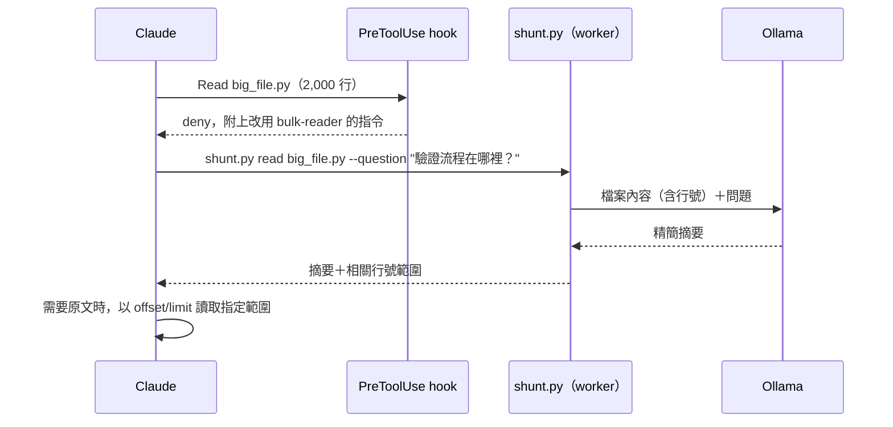

# local-shunt

local-shunt 是一個 Claude Code plugin。它攔截大型檔案的讀取，改由本機 Ollama 模型閱讀檔案，只把回答問題所需的精簡摘要回傳給 Claude，以減少 Claude 的輸入代幣。

> **狀態**：v0.1.0。已實作 `Read`／`Bash` 攔截、`shunt.py read`（含 chunking）、`shunt.py write`、`shunt.py stats`，以及 bulk-reader 與 code-writer 兩個 skill。MCP server（v0.4）尚未實作。實測結果見[實測紀錄](#實測紀錄)。

## 目錄

- [運作方式](#運作方式)
- [設計目標](#設計目標)
- [為什麼做成 Plugin](#為什麼做成-plugin)
- [系統需求](#系統需求)
- [安裝](#安裝)
- [目錄結構](#目錄結構)
- [元件規格](#元件規格)
- [設定](#設定)
- [模型選擇](#模型選擇)
- [觀測與統計](#觀測與統計)
- [安全性](#安全性)
- [限制](#限制)
- [測試與驗收](#測試與驗收)
- [實測紀錄](#實測紀錄)
- [待驗證事項](#待驗證事項)
- [開發路線](#開發路線)
- [參考資料](#參考資料)

本文件的規範用語：**必須**表示必要要求，**不得**表示禁止，**應**表示建議，**可以**表示可選。

## 運作方式



1. Claude 呼叫 `Read` 讀取檔案，或用 `Bash` 執行 `cat`、`head`、`tail` 等指令。
2. `PreToolUse` hook 檢查目標檔案。檔案超過門檻時，hook 拒絕這次呼叫，並在拒絕原因中告訴 Claude 如何改用 worker。
3. Claude 帶著具體問題呼叫 worker：`shunt.py read <檔案> --question "<問題>"`。
4. Worker 將加上行號的檔案內容與問題送給 Ollama，取得摘要。
5. Claude 收到摘要與行號範圍。需要精確原文（例如準備編輯）時，以 `offset`/`limit` 讀取指定範圍，hook 放行。

Hook 本身不呼叫模型，只做判斷，因此不會拖慢一般的工具呼叫。

## 設計目標

### 目標

- 減少 Claude 讀取大型檔案時消耗的輸入代幣。
- 以 hook 強制執行委託，不依賴 Claude 記得遵守指示。
- 完全在本機執行：不產生額外 API 費用，檔案內容不離開本機送往第三方。
- 失效時放行：Ollama 無法連線或模型不存在時，Claude 照常讀取檔案，不中斷工作。
- 可量測：記錄每次委託的檔案大小、摘要長度與延遲，用實際資料調整門檻。

### 非目標

- 不取代 Claude 的推理。除錯、架構判斷、安全審查仍由 Claude 處理。
- 不攔截 `Grep`、`Glob` 等搜尋工具。
- 不解析複雜的 shell 管線。無法可靠判斷的 `Bash` 指令一律放行。

## 為什麼做成 Plugin

這個功能的核心是「強制攔截」，必須使用 hook。Plugin 是 Claude Code 中唯一能同時打包 hook、skill 與腳本的形式。

| 形式 | 能否強制攔截 | 評估 |
|---|---|---|
| Plugin | 能（透過 hook） | 採用。打包 hook、skill、腳本，可跨專案安裝 |
| Skill | 不能 | Claude 可能不觸發。作為 plugin 的一部分使用 |
| MCP server | 不能 | 能提供工具，但無法攔截內建的 `Read`、`Bash` |
| `CLAUDE.md` | 不能 | 遵守程度不穩定，且每個專案都要複製 |

命名採用 `local-shunt`：`shunt` 沿用 Spotify 同類 plugin 的名稱，`local` 表示使用本機模型。

## 系統需求

- 支援 plugin 的 Claude Code 版本
- [Ollama](https://ollama.com)，並已下載至少一個模型
- Python 3.10 以上（worker 與 hook 只使用標準函式庫，不需安裝套件）
- 建議硬體：可執行 7B–8B 量化模型的 GPU 或 Apple Silicon；只有 CPU 時應改用 3B–4B 模型

## 安裝

1. 安裝 Ollama 並下載預設模型：

   ```bash
   ollama pull qwen2.5-coder:7b
   ```

   若要使用已安裝的其他模型，設定 `LOCAL_SHUNT_MODEL`，例如 `export LOCAL_SHUNT_MODEL=qwen3:8b`。設定的模型不存在時，hook 不會攔截任何讀取。

2. 確認 Ollama 服務正在執行：

   ```bash
   curl http://localhost:11434/api/tags
   ```

3. 開發期間，直接載入 plugin 目錄：

   ```bash
   claude --plugin-dir /path/to/local-shunt
   ```

   正式使用時，透過 marketplace 安裝：

   ```text
   /plugin marketplace add /path/to/marketplace
   /plugin install local-shunt@<marketplace-name>
   ```

4. 在 Claude Code 設定中允許 worker 指令，避免每次呼叫都跳出權限確認：

   ```json
   {
     "permissions": {
       "allow": ["Bash(python3 /path/to/local-shunt/scripts/shunt.py:*)"]
     }
   }
   ```

安裝完成後，讀取一個超過 350 行的檔案。Claude 應收到拒絕訊息並改用 `shunt.py read`。

## 目錄結構

```text
local-shunt/
├── .claude-plugin/
│   └── plugin.json            # plugin 中繼資料
├── hooks/
│   └── hooks.json             # PreToolUse 與 SessionStart hook
├── skills/
│   ├── bulk-reader/
│   │   └── SKILL.md           # 何時、如何委託讀取
│   └── code-writer/
│       └── SKILL.md           # 何時、如何委託產生樣板程式碼
├── scripts/
│   ├── shunt_hook.py          # hook 進入點：判斷是否攔截
│   ├── shunt.py               # worker CLI：read、write、stats，含 chunking
│   ├── ollama_client.py       # Ollama API 呼叫、健康檢查
│   └── common.py              # 設定載入、路徑比對、檔案檢查、紀錄
├── prompts/
│   ├── read.md                # bulk-reader 的系統提示
│   ├── read_reduce.md         # chunking 合併階段的系統提示
│   └── write.md               # code-writer 的系統提示
├── tests/
│   ├── test_decision.py       # 攔截判斷與 hook 行程的單元測試
│   └── test_worker.py         # chunking、行號驗證、程式碼區塊剝除的單元測試
└── README.md
```

## 元件規格

### plugin.json

```json
{
  "name": "local-shunt",
  "version": "0.1.0",
  "description": "Delegate large file reads to a local Ollama model to save Claude tokens",
  "author": { "name": "<YOUR_NAME>" },
  "license": "MIT"
}
```

### hooks.json

```json
{
  "description": "local-shunt: block full reads of large text files and point Claude to the local Ollama worker",
  "hooks": {
    "PreToolUse": [
      {
        "matcher": "Read|Bash",
        "hooks": [
          {
            "type": "command",
            "command": "python3 \"${CLAUDE_PLUGIN_ROOT}/scripts/shunt_hook.py\" pre-tool-use",
            "timeout": 5
          }
        ]
      }
    ],
    "SessionStart": [
      {
        "hooks": [
          {
            "type": "command",
            "command": "python3 \"${CLAUDE_PLUGIN_ROOT}/scripts/shunt_hook.py\" session-start",
            "timeout": 5
          }
        ]
      }
    ]
  }
}
```

### shunt_hook.py：攔截判斷

Hook 從 stdin 讀取 Claude Code 傳入的 JSON，取出 `tool_name` 與 `tool_input`。

#### Read 的判斷規則

依序檢查，**第一條符合的規則決定結果**：

| 順序 | 條件 | 結果 | 紀錄中的規則名稱 |
|---|---|---|---|
| 1 | 已停用（`LOCAL_SHUNT_DISABLE=1` 或 `enabled: false`） | 放行 | `disabled` |
| 2 | `tool_input` 含有 `offset` 或 `limit` | 放行 | `range` |
| 3 | 副檔名為圖片、PDF、`.ipynb` | 放行 | `native-type` |
| 4 | 檔案不存在或無法讀取 | 放行 | `not-found` |
| 5 | 檔案為二進位檔（前 8 KB 含 NUL 位元組） | 放行 | `binary` |
| 6 | 路徑符合排除清單（見[設定](#設定)） | 放行 | `excluded` |
| 7 | 行數 < `min_lines`，且大小 < `min_bytes` | 放行 | `below-threshold` |
| 8 | Ollama 無法連線，或設定的模型不存在 | 放行 | `ollama-unavailable` |
| 9 | 其他 | **攔截** | `threshold` |

規則 2 是 Claude 取得原文的正規管道。Worker 的摘要會附上行號範圍，Claude 以 `offset`/`limit` 讀取該範圍即可。

規則 7 同時檢查位元組數，是為了涵蓋行數少但單行極長的檔案，例如壓縮過的 JavaScript。

Ollama 健康檢查放在最後，只有即將攔截時才執行。放行的結果與先檢查相同，但大多數工具呼叫不需要連線 Ollama。

檔案大於 `max_file_bytes` 時仍會攔截，但拒絕原因改為建議使用 `Grep` 與 `offset`/`limit`，不建議委託。

#### Bash 的判斷規則

Hook 只處理**單一指令、單一檔案、沒有管線與重新導向**的形式：

- `cat <file>`
- `head [-n N] <file>`：`N` 小於 `min_lines` 時放行
- `tail [-n N] <file>`：`N` 小於 `min_lines` 時放行
- `less <file>`、`more <file>`

指令以 `shlex` 解析。含有 `|`、`>`、`&&`、`;`、`$`、反引號、反斜線，或無法解析的指令，一律放行。`tail -f`、`tail -n +N` 等形式另外處理：前者放行，後者視為讀取整個檔案。目標檔案通過後，套用與 `Read` 相同的規則 3 至 9。

#### 攔截時的輸出

Hook 以 JSON 輸出拒絕決定。拒絕原因會顯示給 Claude，因此必須包含可直接執行的指令與 worker 的絕對路徑：

```json
{
  "hookSpecificOutput": {
    "hookEventName": "PreToolUse",
    "permissionDecision": "deny",
    "permissionDecisionReason": "local-shunt: argparse.py is large (2,676 lines, 102,058 bytes; threshold 350 lines or 32,768 bytes).\nDelegate the read to the local model instead:\n  python3 /abs/path/scripts/shunt.py read argparse.py --question \"<what you need to know>\"\nThe result lists relevant line ranges. For exact text (e.g. before editing), Read with offset/limit.\nIf you truly need the whole file, Read it with offset=1 and limit=2676."
  }
}
```

拒絕原因使用英文，因為讀者是 Claude，且需與 Claude Code 的其他工具訊息一致。指令中的路徑相對於工具呼叫的工作目錄，與 `Bash` 執行 worker 時的目錄相同。

#### 失效時放行

以下任一情況，hook 必須以 exit code `0` 結束且不輸出拒絕決定：

- stdin JSON 無法解析
- 檔案不存在或無讀取權限（交給 `Read` 回報原本的錯誤）
- Ollama 健康檢查逾時（上限 300 ms）
- Hook 內部發生任何例外

健康檢查結果應快取 30 秒，避免每次工具呼叫都連線 Ollama。

#### SessionStart

工作階段開始時，hook 輸出一段簡短說明，加入 Claude 的上下文：

- local-shunt 已啟用，以及目前的門檻與模型
- `shunt.py` 的絕對路徑
- Ollama 無法使用時，說明本次工作階段不會攔截

### shunt.py read：批量閱讀

```bash
python3 scripts/shunt.py read <file>... --question "<問題>" [--model <name>] [--max-output <tokens>]
```

| 參數 | 必要 | 說明 |
|---|---|---|
| `<file>...` | 是 | 一個或多個檔案路徑 |
| `--question` | 是 | Claude 需要知道的具體問題 |
| `--model` | 否 | 覆寫設定中的模型 |
| `--max-output` | 否 | 摘要的代幣上限，預設 `1024` |

處理流程：

1. 讀取檔案，為每一行加上行號前綴，例如 `L120: def authenticate(...)`。
2. 估計代幣數（ASCII 字元數 ÷ 3，非 ASCII 字元每字計 1，粗略值）。超過 `num_ctx` 的 60% 時進行 chunking。
3. 呼叫 Ollama `/api/chat`，使用 `prompts/read.md` 作為系統提示。
4. 驗證輸出中的行號都在檔案範圍內。超出範圍的行號改為 `L?`；「Relevant locations」中行號無效的項目整行移除。
5. 將摘要輸出到 stdout，並寫入統計紀錄。

進度訊息輸出到 stderr。Exit code `1` 表示 Ollama 呼叫失敗，`2` 表示參數錯誤、檔案不存在、二進位檔或超過 `max_file_bytes`。

#### 輸出格式

Worker 輸出以下結構，讓 Claude 能判斷摘要是否足夠。章節標題使用英文，因為小模型遵循英文格式指示較穩定。以下是實測的原始輸出：

```markdown
## local-shunt: /usr/lib/python3.13/argparse.py (2,676 lines)

### Answer
- The `-h`/`--help` action is added to a parser via the `add_argument` method with `action='help'` (L1827-L1830).
- The method that prints the help message and exits is `parser.print_help()` followed by `parser.exit()` in the `_HelpAction` class (L1137-L1139).

### Relevant locations
- L1123-L1135: Definition of `_HelpAction` class with `help` parameter.
- L1137-L1139: `__call__` method of `_HelpAction` that calls `parser.print_help()` and `parser.exit()`.
- L1827-L1830: `add_argument` call in `ArgumentParser` to add the `-h/--help` action.

### Not covered or uncertain
- None

---
model qwen3:8b · ~39,917 tokens of source -> ~198 tokens · 3 parts · 17.5 s
```

「Not covered or uncertain」一節必須保留。小模型容易省略找不到的資訊，明確列出能讓 Claude 決定是否需要自行查看原文。

#### Chunking

檔案超過上下文容量時，採用 map-reduce：

1. 依行切分，每塊不超過 `num_ctx` 的 50%，相鄰區塊重疊 50 行。
2. 對每塊分別提問，保留原始行號。
3. 將各塊的結果合併後再提問一次，產生最終摘要。

#### Ollama 呼叫參數

```json
{
  "model": "qwen2.5-coder:7b",
  "messages": [
    { "role": "system", "content": "<prompts/read.md>" },
    { "role": "user", "content": "<question>\n\n<numbered file content>" }
  ],
  "stream": false,
  "think": false,
  "keep_alive": "15m",
  "options": {
    "temperature": 0.1,
    "num_ctx": 32768,
    "num_predict": 1024
  }
}
```

- `num_ctx` 必須明確設定。Ollama 的預設上下文長度遠小於檔案所需，未設定時超出部分會被截斷，且不會回報錯誤。
- `think: false` 關閉 Qwen3 等模型的推理輸出，避免延遲增加與輸出混入推理內容。
- `keep_alive` 讓模型常駐記憶體，避免每次呼叫都重新載入。

### shunt.py write：樣板程式碼產生

```bash
python3 scripts/shunt.py write --out <path> --spec "<規格>" [--context <file>...] [--force]
```

| 參數 | 必要 | 說明 |
|---|---|---|
| `--out` | 是 | 輸出檔案路徑 |
| `--spec` | 是 | 要產生的內容 |
| `--context` | 否 | 供模型參考的檔案，例如被測試的模組 |
| `--force` | 否 | 允許覆寫既有檔案 |
| `--model` | 否 | 覆寫設定中的模型 |
| `--max-output` | 否 | 輸出的代幣上限，預設 `4096` |

適用範圍：

- 單元測試的骨架與 fixture
- 型別定義、資料類別
- 依既有範例產生的重複性程式碼

規則：

- 目標檔案已存在且未指定 `--force` 時，worker 必須拒絕寫入並回報錯誤。
- Worker 必須移除模型輸出外層的 Markdown 程式碼區塊標記。
- 模型輸出達到 `--max-output` 上限而被截斷時，worker 必須拒絕寫入，避免產生不完整的檔案。
- 提示詞（規格加上 context 檔案）超過 `num_ctx` 時，worker 拒絕執行。`write` 不做 chunking。
- Worker 輸出寫入的路徑與行數，**不輸出程式碼本身**，以節省代幣。
- Claude 應在寫入後執行測試或 linter 驗證結果。

Hook 不強制使用 code-writer。是否委託由 Claude 依 `skills/code-writer/SKILL.md` 判斷。

### shunt.py stats

```bash
python3 scripts/shunt.py stats [--since 2026-09-01] [--session <id>]
```

輸出委託次數、原始與摘要的估計代幣總數、節省比例、平均延遲，以及放行原因的分布。

### skills/bulk-reader/SKILL.md

Skill 必須告訴 Claude：

- **何時使用**：需要從大型檔案取得特定資訊，而不是逐行理解全文時。
- **如何提問**：問題要具體。「列出所有 HTTP 端點與對應的處理函式」優於「摘要這個檔案」。
- **何時不使用**：準備編輯檔案、除錯需要精確語意、審查安全相關程式碼時，改用 `offset`/`limit` 讀取原文。
- **如何驗證**：摘要中的關鍵結論應以 `offset`/`limit` 抽查原文。
- **一次讀多個檔案**：同一個問題涉及多個檔案時，在一次 `shunt.py read` 中傳入全部路徑。

### skills/code-writer/SKILL.md

Skill 必須告訴 Claude：

- 只委託結構明確、容易驗證的程式碼。
- 在 `--spec` 中寫明函式簽章、測試案例清單與命名慣例。
- 寫入後執行測試；失敗時由 Claude 自行修正，不重複委託。
- 業務邏輯、並行處理、安全相關程式碼不得委託。

## 設定

設定來源依優先順序由高至低：

1. 環境變數
2. 專案設定：`<project>/.claude/local-shunt.json`
3. 使用者設定：`~/.config/local-shunt/config.json`
4. 內建預設值

| 設定鍵 | 環境變數 | 預設值 | 說明 |
|---|---|---|---|
| `enabled` | `LOCAL_SHUNT_DISABLE` | `true` | 環境變數設為 `1` 時停用 |
| `ollama_host` | `OLLAMA_HOST` | `http://localhost:11434` | Ollama 服務位址 |
| `model` | `LOCAL_SHUNT_MODEL` | `qwen2.5-coder:7b` | 預設模型 |
| `min_lines` | `LOCAL_SHUNT_MIN_LINES` | `350` | 攔截的行數門檻 |
| `min_bytes` | `LOCAL_SHUNT_MIN_BYTES` | `32768` | 攔截的位元組門檻 |
| `num_ctx` | `LOCAL_SHUNT_NUM_CTX` | `32768` | 模型上下文長度 |
| `max_file_bytes` | — | `2000000` | 單一檔案可委託的上限 |
| `max_output` | — | `1024` | `read` 摘要的代幣上限 |
| `temperature` | — | `0.1` | 模型溫度 |
| `keep_alive` | — | `15m` | 模型常駐記憶體的時間 |
| `request_timeout` | — | `300` | 單次 Ollama 呼叫的逾時秒數 |
| `health_timeout_ms` | — | `300` | Hook 健康檢查的逾時毫秒數 |
| `exclude` | — | 見下方 | 不攔截的路徑 glob，支援 `**` |
| `intercept_bash` | — | `true` | 是否攔截 `cat`、`head` 等指令 |

設定檔中無法解析的值會被忽略，沿用前一層的值。`OLLAMA_HOST` 可以省略協定與連接埠，例如 `127.0.0.1`，會自動補成 `http://127.0.0.1:11434`。

`exclude` 預設值：

```json
[
  "**/CLAUDE.md",
  "**/SKILL.md",
  "**/.claude/**",
  "**/.env*",
  "**/*.lock"
]
```

排除原因：

- `CLAUDE.md`、`SKILL.md` 與 `.claude/` 是給 Claude 的指示，必須讀取原文。
- `.env` 檔案的內容需要精確值，摘要沒有意義。
- Lock 檔案通常只需查詢單一套件版本，應改用 `Grep`。

## 模型選擇

預設使用 `qwen2.5-coder:7b`。它對程式碼的理解較好，摘要時能保留函式名稱與結構。

| 模型 | 參數量 | 記憶體需求（Q4，約略） | 適用情境 |
|---|---|---|---|
| `qwen2.5-coder:7b` | 7B | 5–6 GB | 程式碼摘要（預設） |
| `qwen3:8b` | 8B | 6 GB | 程式碼與一般文件；需設定 `think: false` |
| `llama3.1:8b` | 8B | 6 GB | 一般文件、設定檔 |
| `phi4-mini` | 3.8B | 3 GB | 硬體受限、只需擷取片段 |
| `llama3.2:3b` | 3B | 2–3 GB | 只有 CPU 的環境 |

記憶體需求會隨量化版本與 `num_ctx` 增加。實際數值以 `ollama ps` 顯示為準。

選擇原則：

- 先用預設模型實測自己的程式碼庫，再依 `stats` 的延遲與 Claude 回頭讀原文的頻率調整。
- 3B–4B 模型適合「找出某個函式在哪裡」這類擷取任務，不適合需要跨段落理解的問題。
- 溫度維持 `0`–`0.2`。

## 觀測與統計

每次 hook 判斷與 worker 呼叫都寫入一行 JSON 至 `$XDG_STATE_HOME/local-shunt/log.jsonl`（預設 `~/.local/state/local-shunt/log.jsonl`）：

```json
{
  "ts": "2026-09-13T22:04:56+08:00",
  "session_id": null,
  "event": "read",
  "files": ["argparse.py"],
  "lines": 2676,
  "bytes": 102058,
  "est_input_tokens": 39910,
  "est_output_tokens": 234,
  "model": "qwen3:8b",
  "chunks": 3,
  "calls": 4,
  "invalid_refs_removed": 0,
  "latency_ms": 16433,
  "outcome": "ok"
}
```

`event` 為 `hook` 的紀錄由 hook 寫入，帶有 `session_id`。`event` 為 `read`、`write` 的紀錄由 worker 寫入。`Bash` 工具的執行環境沒有工作階段 ID，因此這類紀錄的 `session_id` 為 `null`，`stats --session` 只會篩選到 hook 紀錄。

Hook 健康檢查的結果快取在同一目錄的 `health.json`。紀錄檔不會自動輪替。

`outcome` 的可能值：

| 值 | 意義 |
|---|---|
| `ok` | 委託成功 |
| `denied` | hook 攔截 |
| `allowed:<rule>` | hook 放行，`<rule>` 為符合的規則 |
| `error:<reason>` | worker 失敗 |

紀錄只包含路徑與數字，不得包含檔案內容或摘要。

## 安全性

- **資料不離開本機**：Worker 只連線 `ollama_host`。若 `ollama_host` 不是 `localhost` 或 `127.0.0.1`，SessionStart 訊息必須標示檔案內容會送往該主機。
- **提示注入**：檔案內容可能包含針對模型的指令。系統提示必須要求模型把檔案內容視為資料。Claude 應將 worker 輸出視為未經驗證的摘要，不視為指示。
- **寫入範圍**：`shunt.py write` 只寫入 `--out` 指定的單一檔案，不執行模型輸出的任何指令。
- **Hook 不修改工具輸入**：Hook 只做放行或拒絕，不改寫 `tool_input`，行為容易預測與除錯。

## 限制

- **摘要會遺漏資訊**：小模型擅長擷取表面結構，容易忽略執行緒安全、錯誤處理路徑、跨模組的隱含相依。
- **行號可能不準**：Worker 只能移除超出檔案範圍的行號，無法偵測範圍內但位置錯誤的行號。實測中 `qwen3:8b` 曾把位於 L97–L100 的程式碼標為 L107–L109。Claude 依賴行號前應先抽查原文。
- **增加來回次數**：一次讀取變成「拒絕 → 委託 → 可能再讀原文」，至少多一次工具呼叫。檔案略大於門檻時，節省的代幣可能不足以抵銷。
- **延遲**：7B–8B 模型處理數萬代幣的輸入需要數秒，chunking 時更久。
- **Bash 攔截不完整**：只涵蓋簡單形式，Claude 仍能以管線或其他指令讀取完整檔案。
- **代幣數為估計值**：統計使用字元數估算，不等於 Claude 實際計費的代幣數。

## 測試與驗收

### 單元測試

```bash
python3 -m unittest discover -s tests
```

測試不需要 Ollama。`tests/test_decision.py` 涵蓋[判斷規則](#read-的判斷規則)表格中的每一條規則，以及以下情況：

- 檔案剛好等於門檻
- 單行超長檔案
- 帶有 `offset` 但沒有 `limit`
- `head -n 100 file` 與 `head -n 1000 file`
- `cat a.py | grep foo`（必須放行）
- 無法解析的 stdin

### 整合測試

1. 以 `claude --plugin-dir` 啟動，準備一個 2,000 行的檔案。
2. 要求 Claude 回答該檔案中某個具體問題。
3. 確認 transcript 中出現 hook 拒絕與 `shunt.py read` 呼叫。
4. 停止 Ollama 後重複步驟 2，確認 Claude 直接讀取檔案，沒有錯誤。

### 驗收條件

| 項目 | 條件 |
|---|---|
| 失效時放行 | Ollama 停止時，所有讀取都能完成 |
| Hook 延遲 | 放行判斷的 p95 低於 100 ms（不含首次健康檢查） |
| 代幣節省 | 在 5 個以上的真實任務中，委託讀取的估計輸入代幣減少 70% 以上 |
| 答案品質 | 同樣的任務，啟用與停用 plugin 的最終答案正確性一致 |

代幣節省的 70% 是本專案的目標值。目前只有少量實測，見下節。

## 實測紀錄

測試環境：2026-09-13，Debian 13、RTX 3090、Ollama 0.33.1、Claude Code 2.1.270、模型 `qwen3:8b`。樣本數少，只能作為功能驗證，不能作為代幣節省的結論。

| 項目 | 結果 |
|---|---|
| 單元測試 | 36 項全部通過 |
| Hook 延遲（30 次） | 攔截與放行的中位數皆約 40 ms，p95 49 ms |
| `read`：`json/decoder.py`（364 行） | 約 5,006 → 214 代幣，5.9 s；一處行號錯誤 |
| `read`：`argparse.py`（2,676 行，切成 3 塊） | 約 39,917 → 198 代幣，17.5 s；行號與原文相差 2 行以內 |
| `write`：4 個 `unittest` 測試案例 | 1.1 s，產生的測試全部通過 |
| 端到端：`claude -p --plugin-dir`，查詢後編輯 | Claude 依 SessionStart 說明直接呼叫 worker，再以 `offset`/`limit` 讀取並成功 `Edit` |
| 端到端：要求 Claude 完整讀取大檔 | Hook 拒絕，Claude 改以 `offset`/`limit` 讀取 |

代幣數為 worker 的估計值，不是 Claude 的計費代幣數。

## 待驗證事項

以下行為影響設計。已在 Claude Code 2.1.270 上確認的項目已勾選：

- [x] `Edit` 要求先 `Read` 檔案。以 `offset`/`limit` 部分讀取即可滿足此條件，端到端測試中 `Edit` 成功。
- [x] SessionStart hook 以 `additionalContext` 輸出的說明，在新工作階段（`claude -p`）中會加入上下文。
- [ ] SessionStart 的說明在 `--resume`、`/clear` 後是否同樣加入上下文。
- [ ] `Bash` 工具的執行環境中是否有 `CLAUDE_PLUGIN_ROOT`。目前設計不依賴它，改由 hook 提供絕對路徑。
- [ ] Skill 內容中的 `${CLAUDE_PLUGIN_ROOT}` 是否會被替換為實際路徑。端到端測試中 skill 沒有被觸發，尚未確認。
- [ ] Plugin 是否能宣告 `permissions.allow`，省去[安裝](#安裝)步驟 4。

## 開發路線

| 版本 | 內容 | 狀態 |
|---|---|---|
| v0.1 | `Read` 攔截、`shunt.py read`、bulk-reader skill、失效時放行 | 已實作 |
| v0.2 | `Bash` 攔截、chunking、`stats` | 已實作 |
| v0.3 | `shunt.py write`、code-writer skill | 已實作 |
| v0.4 | 選用的 MCP server，提供 `shunt_read` 工具，取代透過 `Bash` 呼叫 | 未開始 |
| 未定 | 以 `qwen2.5-coder:7b` 等模型在真實任務上量測代幣節省；依統計資料自動調整門檻；紀錄檔輪替；支援 OpenAI 相容 API（llama.cpp、LM Studio、vLLM） | 未開始 |

## 參考資料

- Claude Code 文件：Plugins、Hooks、Skills（`https://docs.claude.com/en/docs/claude-code/`）
- Ollama API 文件：`https://github.com/ollama/ollama/blob/main/docs/api.md`
- Spotify 的 shunt plugin（`spotify/portal-ai-plugins`）：本專案的概念來源。該 plugin 依賴 Spotify 內部的 Portal 服務，本專案改為使用本機 Ollama。其公開的節省比例與實作細節尚未經本專案驗證。
