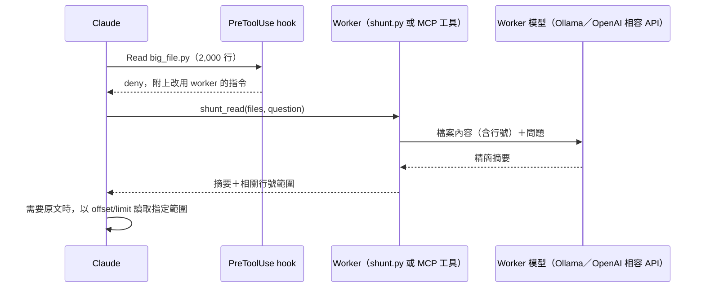

# local-shunt

local-shunt 是一個 Claude Code plugin。它攔截大型檔案的讀取，改由 worker 模型閱讀檔案，只把回答問題所需的精簡摘要回傳給 Claude，以減少 Claude 的輸入代幣。

Worker 模型預設使用本機 Ollama，也可以改用 OpenAI 相容 API，例如 OpenRouter、OpenAI、LM Studio、llama.cpp 或 vLLM。

> **狀態**：v0.2.0。已實作 `Read`／`Bash` 攔截、`shunt.py read`（含 chunking）、`write`、`stats`、MCP server、外部 API provider、Claude 代幣用量的量測（`usage`、`bench`），以及 bulk-reader 與 code-writer 兩個 skill。143 項自動測試全部通過。實測結果見[實測紀錄](#實測紀錄)。

## 目錄

- [運作方式](#運作方式)
- [設計目標](#設計目標)
- [為什麼做成 Plugin](#為什麼做成-plugin)
- [系統需求](#系統需求)
- [安裝](#安裝)
- [使用外部 API](#使用外部-api)
- [目錄結構](#目錄結構)
- [元件規格](#元件規格)
- [設定](#設定)
- [模型選擇](#模型選擇)
- [觀測與統計](#觀測與統計)
- [安全性](#安全性)
- [限制](#限制)
- [測試與驗收](#測試與驗收)
- [實測紀錄](#實測紀錄)
- [待驗證事項](#待驗證事項)
- [開發路線](#開發路線)
- [授權](#授權)
- [參考資料](#參考資料)

本文件的規範用語：**必須**表示必要要求，**不得**表示禁止，**應**表示建議，**可以**表示可選。

## 運作方式



1. Claude 呼叫 `Read` 讀取檔案，或用 `Bash` 執行 `cat`、`head`、`tail` 等指令。
2. `PreToolUse` hook 檢查目標檔案。檔案超過門檻時，hook 拒絕這次呼叫，並在拒絕原因中告訴 Claude 如何改用 worker。
3. Claude 帶著具體問題呼叫 worker：`shunt_read` MCP 工具，或 `shunt.py read <檔案> --question "<問題>"`。
4. Worker 將加上行號的檔案內容與問題送給 worker 模型，取得摘要。
5. Claude 收到摘要與行號範圍。需要精確原文（例如準備編輯）時，以 `offset`/`limit` 讀取指定範圍，hook 放行。

Hook 本身不呼叫模型，也不連線遠端服務，因此不會拖慢一般的工具呼叫。

工作階段開始時，SessionStart hook 會告訴 Claude 這個 plugin 已啟用。實測中 Claude 通常會主動改用 worker，不必等到被 hook 拒絕。

## 設計目標

### 目標

- 減少 Claude 讀取大型檔案時消耗的輸入代幣。
- 以 hook 強制執行委託，不依賴 Claude 記得遵守指示。
- 預設在本機執行：使用 Ollama 時不產生額外 API 費用，檔案內容不離開本機。
- 使用者明確設定後，可以改用外部 API，並在每個工作階段開始時標示資料的去向。
- 失效時放行：worker 無法使用時，Claude 照常讀取檔案，不中斷工作。
- 可量測：記錄每次委託的檔案大小、摘要長度、延遲與 API 費用，並以 transcript 與對照測試量測 Claude 實際消耗的代幣，用實際資料調整門檻。

### 非目標

- 不取代 Claude 的推理。除錯、架構判斷、安全審查仍由 Claude 處理。
- 不攔截 `Grep`、`Glob` 等搜尋工具。
- 不解析複雜的 shell 管線。無法可靠判斷的 `Bash` 指令一律放行。

## 為什麼做成 Plugin

這個功能的核心是「強制攔截」，必須使用 hook。Plugin 是 Claude Code 中唯一能同時打包 hook、skill、MCP server 與腳本的形式。

| 形式 | 能否強制攔截 | 在本專案中的角色 |
|---|---|---|
| Plugin | 能（透過 hook） | 外層封裝，可跨專案安裝 |
| Skill | 不能 | 教 Claude 何時委託、如何提問與核對 |
| MCP server | 不能 | 提供 `shunt_read` 等工具，比透過 `Bash` 呼叫更容易使用 |
| `CLAUDE.md` | 不能 | 不使用。遵守程度不穩定，且每個專案都要複製 |

命名採用 `local-shunt`：`shunt` 沿用 Spotify 同類 plugin 的名稱，`local` 表示預設使用本機模型。

## 系統需求

- 支援 plugin 的 Claude Code 版本（實測版本為 2.1.270）
- Python 3.10 以上。Hook、worker 與 MCP server 只使用標準函式庫，不需安裝套件
- 以下任一種 worker：
  - [Ollama](https://ollama.com)，並已下載至少一個模型。建議使用可執行 7B–8B 量化模型的 GPU 或 Apple Silicon；只有 CPU 時應改用 3B–4B 模型
  - OpenAI 相容 API 的端點與金鑰，見[使用外部 API](#使用外部-api)

## 安裝

1. 安裝 Ollama 並下載預設模型：

   ```bash
   ollama pull qwen2.5-coder:7b
   ```

   若要使用已安裝的其他模型，設定 `LOCAL_SHUNT_MODEL`，例如 `export LOCAL_SHUNT_MODEL=qwen3:8b`。設定的模型不存在時，hook 不會攔截任何讀取。

2. 確認 Ollama 服務正在執行：

   ```bash
   curl http://localhost:11434/api/tags
   ```

3. 開發期間，直接載入 plugin 目錄：

   ```bash
   claude --plugin-dir /path/to/local-shunt
   ```

   正式使用時，透過 marketplace 安裝：

   ```text
   /plugin marketplace add /path/to/marketplace
   /plugin install local-shunt@<marketplace-name>
   ```

4. 在 Claude Code 設定中允許 worker，避免每次呼叫都跳出權限確認：

   ```json
   {
     "permissions": {
       "allow": [
         "mcp__plugin_local-shunt_local-shunt__shunt_read",
         "mcp__plugin_local-shunt_local-shunt__shunt_stats",
         "Bash(python3 /path/to/local-shunt/scripts/shunt.py read:*)"
       ]
     }
   }
   ```

   `shunt_write` 會寫入檔案，建議保留權限確認。

安裝完成後，讀取一個超過 350 行的檔案。Claude 應改用 `shunt_read`，或在被 hook 拒絕後改用。

## 使用外部 API

外部 API 適合沒有 GPU 的機器，或需要比本機模型更大的上下文與更好的品質時使用。**檔案內容會送往該服務**，使用前應確認服務商的資料保留政策。

### OpenRouter

1. 建立使用者設定檔 `~/.config/local-shunt/config.json`：

   ```json
   {
     "provider": "openrouter",
     "model": "nvidia/nemotron-3.5-lightning:free",
     "num_ctx": 131072
   }
   ```

2. 提供 API 金鑰，以下三種方式擇一：

   - 環境變數：`export OPENROUTER_API_KEY=<YOUR_API_KEY>`
   - `.env` 檔：寫入 `~/.config/local-shunt/.env`，或在使用者設定中指定既有的檔案：

     ```json
     {
       "provider": "openrouter",
       "model": "nvidia/nemotron-3.5-lightning:free",
       "num_ctx": 131072,
       "env_files": ["/path/to/apps/api/.env"]
     }
     ```

   - 使用者設定檔：`"api_keys": { "openrouter": "<YOUR_API_KEY>" }`。此檔案應設為只有自己可讀取（`chmod 600`）。

3. 開啟新的工作階段。SessionStart 說明中應出現 `provider openrouter`，以及「檔案內容會送往 `https://openrouter.ai/api/v1`」的提示。

`num_ctx` 應依模型的實際上下文長度調大。這個值決定 chunking 的切塊大小；值越大，大檔案需要的請求次數越少，被限速的機會也越低。

### 其他 OpenAI 相容服務

| 服務 | 設定 |
|---|---|
| OpenAI | `"provider": "openai"`，金鑰放在 `OPENAI_API_KEY` |
| LM Studio | `"provider": "openai-compatible"`、`"api_base": "http://127.0.0.1:1234/v1"` |
| llama.cpp server | `"provider": "openai-compatible"`、`"api_base": "http://127.0.0.1:8080/v1"` |
| Ollama 的 OpenAI 相容端點 | `"provider": "openai-compatible"`、`"api_base": "http://127.0.0.1:11434/v1"` |
| 其他需要金鑰的服務 | `"provider": "openai-compatible"`、`"api_base"`，以及 `"api_key_env": "<變數名稱>"` |

單次呼叫也可以用參數覆寫：`shunt.py read a.py -q "..." --provider openrouter --model <model-id>`，MCP 工具則使用 `provider`、`model` 參數。

## 目錄結構

```text
local-shunt/
├── .claude-plugin/
│   └── plugin.json            # plugin 中繼資料
├── .mcp.json                  # 註冊 MCP server
├── .github/workflows/
│   ├── test.yml               # GitHub Actions：自動測試
│   └── secrets.yml            # GitHub Actions：以 gitleaks 掃描金鑰
├── .githooks/
│   └── pre-commit             # commit 前以 gitleaks 掃描金鑰
├── .gitleaks.toml             # gitleaks 規則
├── hooks/
│   └── hooks.json             # PreToolUse 與 SessionStart hook
├── skills/
│   ├── bulk-reader/
│   │   └── SKILL.md           # 何時、如何委託讀取
│   └── code-writer/
│       └── SKILL.md           # 何時、如何委託產生樣板程式碼
├── scripts/
│   ├── shunt_hook.py          # hook 進入點：判斷是否攔截、SessionStart 說明
│   ├── shunt.py               # worker CLI 與核心邏輯：read、write、stats、chunking
│   ├── measure.py             # 代幣量測：transcript 解析、對照測試、報表
│   ├── mcp_server.py          # MCP server：shunt_read、shunt_write、shunt_stats
│   ├── providers.py           # Ollama 與 OpenAI 相容 API、重試、健康檢查
│   └── common.py              # 設定載入、金鑰解析、路徑比對、檔案檢查、紀錄
├── bench/
│   └── example-tasks.json     # 對照測試的範例任務
├── prompts/
│   ├── read.md                # 讀取的系統提示
│   ├── read_reduce.md         # chunking 合併階段的系統提示
│   └── write.md               # 產生檔案的系統提示
├── tests/
│   ├── helpers.py             # 環境隔離與模擬 LLM HTTP 伺服器
│   ├── test_decision.py       # 攔截判斷、hook 行程、SessionStart
│   ├── test_config.py         # 設定分層、金鑰解析、紀錄輪替
│   ├── test_providers.py      # Ollama 與 OpenAI 相容 provider
│   ├── test_worker.py         # chunking、行號驗證、read/write/stats、CLI
│   ├── test_measure.py        # transcript 解析、worker 紀錄對應、對照測試與報表
│   └── test_mcp.py            # MCP 協定與工具呼叫
├── LICENSE                    # GNU GPL v3 授權全文
└── README.md
```

## 元件規格

### plugin.json

```json
{
  "name": "local-shunt",
  "version": "0.2.0",
  "description": "Delegate large file reads to a worker model (local Ollama or an OpenAI-compatible API such as OpenRouter) to save Claude tokens",
  "author": { "name": "cofemei" },
  "license": "GPL-3.0-or-later",
  "keywords": ["ollama", "openrouter", "tokens", "hooks", "mcp", "local-llm"]
}
```

### hooks.json

```json
{
  "description": "local-shunt: block full reads of large text files and point Claude to the worker model",
  "hooks": {
    "PreToolUse": [
      {
        "matcher": "Read|Bash",
        "hooks": [
          {
            "type": "command",
            "command": "python3 \"${CLAUDE_PLUGIN_ROOT}/scripts/shunt_hook.py\" pre-tool-use",
            "timeout": 5
          }
        ]
      }
    ],
    "SessionStart": [
      {
        "hooks": [
          {
            "type": "command",
            "command": "python3 \"${CLAUDE_PLUGIN_ROOT}/scripts/shunt_hook.py\" session-start",
            "timeout": 10
          }
        ]
      }
    ]
  }
}
```

SessionStart 的逾時設為 10 秒，因為使用外部 API 時需要連線檢查端點（上限 3 秒）。

### shunt_hook.py：攔截判斷

Hook 從 stdin 讀取 Claude Code 傳入的 JSON，取出 `tool_name` 與 `tool_input`。

#### Read 的判斷規則

依序檢查，**第一條符合的規則決定結果**：

| 順序 | 條件 | 結果 | 紀錄中的規則名稱 |
|---|---|---|---|
| 1 | 已停用（`LOCAL_SHUNT_DISABLE=1` 或 `enabled: false`） | 放行 | `disabled` |
| 2 | `tool_input` 含有 `offset` 或 `limit` | 放行 | `range` |
| 3 | 副檔名為圖片、PDF、`.ipynb` | 放行 | `native-type` |
| 4 | 檔案不存在或無法讀取 | 放行 | `not-found` |
| 5 | 檔案為二進位檔（前 8 KB 含 NUL 位元組） | 放行 | `binary` |
| 6 | 路徑符合排除清單（見[設定](#設定)） | 放行 | `excluded` |
| 7 | 行數 < `min_lines`，且大小 < `min_bytes` | 放行 | `below-threshold` |
| 8 | Worker 無法使用（見下方） | 放行 | `worker-unavailable` |
| 9 | 其他 | **攔截** | `threshold` |

規則 2 是 Claude 取得原文的正規管道。Worker 的摘要會附上行號範圍，Claude 以 `offset`/`limit` 讀取該範圍即可。

規則 7 同時檢查位元組數，是為了涵蓋行數少但單行極長的檔案，例如壓縮過的 JavaScript。

規則 8 只在即將攔截時才檢查，大多數工具呼叫不需要做這項檢查。判斷方式依端點而異：

| 端點 | 檢查方式 | 快取 |
|---|---|---|
| 本機（`localhost`、`127.0.0.1`、`::1`） | 連線列出模型，逾時 300 ms，確認模型存在 | 30 秒 |
| 遠端 | 只檢查設定與金鑰，**不連線**；若有 SessionStart 的連線檢查結果，則沿用 | 600 秒 |

檔案大於 `max_file_bytes` 時仍會攔截，但拒絕原因改為建議使用 `Grep` 與 `offset`/`limit`，不建議委託。

#### Bash 的判斷規則

Hook 只處理**單一指令、單一檔案、沒有管線與重新導向**的形式：

- `cat <file>`
- `head [-n N] <file>`：`N` 小於 `min_lines` 時放行
- `tail [-n N] <file>`：`N` 小於 `min_lines` 時放行
- `less <file>`、`more <file>`

指令以 `shlex` 解析。含有 `|`、`>`、`&&`、`;`、`$`、反引號、反斜線，或無法解析的指令，一律放行。`tail -f` 放行；`tail -n +N` 與 `head -n -N` 視為讀取整個檔案。目標檔案通過後，套用與 `Read` 相同的規則 3 至 9。

#### 攔截時的輸出

Hook 以 JSON 輸出拒絕決定。拒絕原因會顯示給 Claude，因此包含可直接執行的指令與 worker 的絕對路徑：

```json
{
  "hookSpecificOutput": {
    "hookEventName": "PreToolUse",
    "permissionDecision": "deny",
    "permissionDecisionReason": "local-shunt: argparse.py is large (2,676 lines, 102,058 bytes; threshold 350 lines or 32,768 bytes).\nDelegate the read to the worker model instead:\n  python3 /abs/path/scripts/shunt.py read argparse.py --question \"<what you need to know>\"\n(or call the shunt_read MCP tool with the same file and question, if available)\nThe result lists relevant line ranges. For exact text (e.g. before editing), Read with offset/limit.\nIf you truly need the whole file, Read it with offset=1 and limit=2676."
  }
}
```

拒絕原因使用英文，因為讀者是 Claude，且需與 Claude Code 的其他工具訊息一致。指令中的路徑相對於工具呼叫的工作目錄。

#### 失效時放行

以下任一情況，hook 必須以 exit code `0` 結束且不輸出拒絕決定：

- stdin JSON 無法解析
- 檔案不存在或無讀取權限（交給 `Read` 回報原本的錯誤）
- Worker 無法使用：本機端點無法連線或沒有模型、金鑰缺失、SessionStart 檢查失敗
- Hook 內部發生任何例外

#### SessionStart

工作階段開始時（包含 `--resume`），hook 連線檢查 worker，並輸出一段說明加入 Claude 的上下文：

- 已啟用時：provider、模型、門檻、`shunt.py` 的絕對路徑、MCP 工具名稱，以及「輸出是未經驗證的摘要」的提醒
- 端點不在本機時：標示檔案內容會送往該服務
- 無法使用時：說明原因，以及本次工作階段不會攔截
- 已停用時：不輸出任何內容

### shunt.py read：批量閱讀

```bash
python3 scripts/shunt.py read <file>... --question "<問題>" [--provider <name>] [--model <name>] [--max-output <tokens>]
```

| 參數 | 必要 | 說明 |
|---|---|---|
| `<file>...` | 是 | 一個或多個檔案路徑 |
| `--question`、`-q` | 是 | Claude 需要知道的具體問題 |
| `--provider` | 否 | 覆寫 provider，並套用該 provider 的預設端點與金鑰變數 |
| `--model` | 否 | 覆寫模型 |
| `--max-output` | 否 | 摘要的代幣上限，預設 `1024` |

處理流程：

1. 讀取檔案，為每一行加上行號前綴，例如 `L120: def authenticate(...)`。
2. 估計代幣數（ASCII 字元數 ÷ 3，非 ASCII 字元每字計 1，粗略值）。超過 `num_ctx` 的 60% 時進行 chunking。
3. 呼叫 worker 模型，使用 `prompts/read.md` 作為系統提示。
4. 驗證輸出中的行號都在檔案範圍內。超出範圍的行號改為 `L?`；「Relevant locations」中行號無效的項目整行移除。
5. 將摘要輸出到 stdout，並寫入統計紀錄。

進度訊息輸出到 stderr。Exit code `1` 表示 worker 呼叫失敗或設定錯誤（例如缺少金鑰），`2` 表示參數錯誤、檔案不存在、二進位檔或超過 `max_file_bytes`。

#### 輸出格式

Worker 輸出以下結構，讓 Claude 能判斷摘要是否足夠。章節標題使用英文，因為小模型遵循英文格式指示較穩定。以下是 OpenRouter 實測的原始輸出：

```markdown
## local-shunt: /usr/lib/python3.13/argparse.py (2,676 lines)

### Answer
- The `-h/--help` action is added in `ArgumentParser.__init__` at lines 1826-1830, conditionally when `self.add_help` is True, using `add_argument` with `default_prefix+'h'` and `default_prefix*2+'help'` (L1827-1830).
- The help message is printed and the program exits via the `_HelpAction.__call__` method at lines 1137-1139, which calls `parser.print_help()` and `parser.exit()`.
- The `ArgumentParser.print_help` method is at lines 2639-2642, and `ArgumentParser.exit` at lines 2656-2659.

### Relevant locations
- (argparse.py:L1826-1830): `-h/--help` argument added via `add_argument` when `add_help=True`.
- (argparse.py:L1137-1139): `_HelpAction.__call__` invokes `parser.print_help()` and `parser.exit()`.
- (argparse.py:L2639-2642): `print_help` method prints the formatted help message.
- (argparse.py:L2656-2659): `exit` method terminates the program with optional stderr message.

### Not covered or uncertain
- How the help action is removed or overridden when `add_help=False` is set.
- The exact interaction between `_HelpAction` and `ArgumentParser.exit` regarding status codes and message handling.

---
openrouter nvidia/nemotron-3.5-lightning:free · ~39,917 tokens of source -> ~375 tokens · 1 part · 10.7 s
```

「Not covered or uncertain」一節必須保留。小模型容易省略找不到的資訊，明確列出能讓 Claude 決定是否需要自行查看原文。

#### Chunking

檔案超過上下文容量時，採用 map-reduce：

1. 依行切分，每塊不超過 `num_ctx` 的 50%，相鄰區塊重疊 50 行。多個小檔案會合併在同一塊。
2. 對每塊分別提問，保留原始行號。
3. 將各塊的結果以 `prompts/read_reduce.md` 合併。合併輸入仍超過上下文時，分批合併後再合併一次。

### Provider

`scripts/providers.py` 提供兩種 provider，對 worker 呈現相同的介面。

#### Ollama

呼叫原生 `/api/chat`：

```json
{
  "model": "qwen2.5-coder:7b",
  "messages": [
    { "role": "system", "content": "<prompts/read.md>" },
    { "role": "user", "content": "Question: <question>\n\n<numbered file content>" }
  ],
  "stream": false,
  "think": false,
  "keep_alive": "15m",
  "options": { "temperature": 0.1, "num_ctx": 32768, "num_predict": 1024 }
}
```

- `num_ctx` 必須明確設定。Ollama 的預設上下文長度遠小於檔案所需，未設定時超出部分會被截斷，且不會回報錯誤。
- `think: false` 關閉 Qwen3 等模型的推理。模型不接受這個欄位時，自動移除後重試。
- `keep_alive` 讓模型常駐記憶體，避免每次呼叫都重新載入。

#### OpenAI 相容 API

呼叫 `<api_base>/chat/completions`，以 `Authorization: Bearer <key>` 驗證：

```json
{
  "model": "nvidia/nemotron-3.5-lightning:free",
  "messages": ["..."],
  "temperature": 0.1,
  "max_tokens": 1024,
  "stream": false,
  "reasoning": { "effort": "none" }
}
```

- **關閉推理**：OpenRouter 送出 `reasoning.effort: "none"`，其他服務送出 `reasoning_effort: "none"`。實測中 Ollama 的 `/v1` 端點若不送這個欄位，qwen3 會把 1,024 個輸出代幣全部用在推理，回傳空白摘要。伺服器以 HTTP 400 或 422 拒絕這個欄位時，自動移除並記住，之後的呼叫不再送出。可以用 `disable_reasoning: false` 關閉這項行為。
- **重試**：只對遠端端點重試。HTTP 408、409、429、5xx 與連線錯誤最多重試 `max_retries` 次，間隔 2、4、8 秒（上限 30 秒）；有 `Retry-After` 標頭且不超過 60 秒時，依標頭等待。本機端點與模型輸出本身的問題（例如推理耗盡輸出預算）不重試。
- **錯誤訊息**：包含 OpenRouter 在 `error.metadata` 中提供的上游原因。
- **費用**：回應的 `usage.cost` 存在時寫入紀錄。
- OpenRouter 請求附帶 `X-Title: local-shunt` 標頭。

### shunt.py write：樣板程式碼產生

```bash
python3 scripts/shunt.py write --out <path> --spec "<規格>" [--context <file>...] [--force] [--provider <name>] [--model <name>] [--max-output <tokens>]
```

| 參數 | 必要 | 說明 |
|---|---|---|
| `--out` | 是 | 輸出檔案路徑 |
| `--spec` | 是 | 要產生的內容 |
| `--context` | 否 | 供模型參考的檔案，例如被測試的模組 |
| `--force` | 否 | 允許覆寫既有檔案 |
| `--provider`、`--model` | 否 | 覆寫 worker 設定 |
| `--max-output` | 否 | 輸出的代幣上限，預設 `4096` |

適用範圍：

- 單元測試的骨架與 fixture
- 型別定義、資料類別
- 依既有範例產生的重複性程式碼

規則：

- 目標檔案已存在且未指定 `--force` 時，worker 必須拒絕寫入。目標是目錄時，即使指定 `--force` 也拒絕。
- Worker 必須移除模型輸出外層的 Markdown 程式碼區塊標記。
- 模型輸出達到 `--max-output` 上限而被截斷，或輸出為空時，worker 必須拒絕寫入。
- 提示詞（規格加上 context 檔案）超過 `num_ctx` 時，worker 拒絕執行。`write` 不做 chunking。
- Worker 輸出寫入的路徑與行數，**不輸出程式碼本身**，以節省代幣。
- Claude 應在寫入後執行測試或 linter 驗證結果。

Hook 不強制使用 code-writer。是否委託由 Claude 依 `skills/code-writer/SKILL.md` 判斷。

### shunt.py stats

```bash
python3 scripts/shunt.py stats [--since 2026-09-01] [--session <id>]
```

輸出 hook 判斷的分布、委託讀取次數、原始與摘要的估計代幣數、節省比例、worker 實際回報的代幣數、平均延遲、各模型的使用次數、API 回報的費用，以及錯誤分布。節省比例是估計值，Claude 實際消耗的代幣見下一節。

### shunt.py usage 與 bench：量測 Claude 的代幣用量

`stats` 的節省比例只比較原始檔案與摘要的估計代幣數，沒有計入攔截造成的額外來回。`usage` 與 `bench` 改用 Claude 實際計費的代幣數。

#### usage：單一工作階段的用量

```bash
python3 scripts/shunt.py usage [<session-id> | <transcript.jsonl>]... [--json]
```

不指定參數時，讀取目前的工作階段（環境變數 `CLAUDE_CODE_SESSION_ID`）。

資料來源是 Claude Code 的 transcript：`~/.claude/projects/<專案>/<session-id>.jsonl`，以及同名目錄下 `subagents/` 中的 subagent transcript。設定了 `CLAUDE_CONFIG_DIR` 時，改從該目錄尋找。

| 項目 | 來源 | 說明 |
|---|---|---|
| API 請求數 | transcript 的 `usage` | Claude Code 把一則回應拆成多筆紀錄，以訊息 ID 去除重複 |
| 輸入代幣 | transcript 的 `usage` | 未快取、快取寫入與快取讀取的總和 |
| 依價格加權的輸入代幣 | transcript 的 `usage` | 未快取 ×1、5 分鐘快取寫入 ×1.25、1 小時快取寫入 ×2、快取讀取 ×0.1 |
| 輸出代幣 | transcript 的 `usage` | 包含 thinking |
| 工具呼叫次數與結果代幣數 | `tool_use`、`tool_result` | 結果代幣數為估計值。`Read` 依有無 `offset`/`limit` 分成兩類；`shunt.py read` 與 `shunt_read` 各自統計 |
| Hook 拒絕次數 | `tool_result` | 含 local-shunt 拒絕訊息的錯誤結果 |
| Worker 用量 | `log.jsonl` | 以 session ID 篩選 |

單一工作階段無法得知停用 plugin 時的用量，因此 `usage` 不計算節省比例。

#### bench：啟用與停用的對照測試

```bash
python3 scripts/shunt.py bench bench/example-tasks.json [--runs 3] [--task <id>]... [--out <file>] [--claude <path>]
python3 scripts/shunt.py bench-report <results.jsonl>...
```

`bench` 以 `claude -p` 執行任務檔中的每個任務，啟用與停用 local-shunt 各執行 `--runs` 次，最後輸出報表。每次執行完成後，結果立即寫入 `--out`，預設為 `$XDG_STATE_HOME/local-shunt/bench/<時間>.jsonl`。中途中斷時，`bench-report` 仍可彙整已完成的結果。

**`bench` 會呼叫 Claude API 並產生費用**，執行次數為任務數 × `--runs` × 2。啟用模式會把檔案內容送往設定的 worker。結果檔包含 Claude 的最終答案。

任務檔格式：

```json
{
  "defaults": { "cwd": "..", "model": "haiku", "timeout": 600 },
  "tasks": [
    {
      "id": "chunk-overlap",
      "prompt": "In scripts/shunt.py, when a file is too large for one worker request, how many lines do adjacent chunks overlap, and which function builds the chunks?",
      "expect": ["\\b50\\b", "build_chunks"]
    }
  ]
}
```

| 欄位 | 必要 | 說明 |
|---|---|---|
| `id` | 是 | 英文字母、數字、`.`、`_` 或 `-` |
| `prompt` | 是 | 送給 Claude 的提示，經由 stdin 傳入 |
| `cwd` | 否 | 工作目錄。相對路徑以任務檔所在目錄為準，預設為任務檔所在目錄 |
| `expect` | 否 | 正規表示式清單。最終答案符合全部規則（不分大小寫）才算通過 |
| `model` | 否 | 傳給 `--model`。未指定時使用 Claude Code 的預設模型 |
| `allowed_tools` | 否 | 傳給 `--allowedTools`。預設為 `Read`、`Grep`、`Glob`、`Bash(python3 <shunt.py 路徑> read:*)` 與 `shunt_read` |
| `timeout` | 否 | 單次執行的秒數上限，預設 900 |

`defaults` 的欄位套用到每個任務，任務中的同名欄位優先。`bench/example-tasks.json` 提供 5 個以本 repository 檔案為題的範例任務，預設使用 Haiku。

為了讓兩種模式只差在 local-shunt 是否生效，`bench` 採用以下做法：

- 兩種模式都以 `--plugin-dir` 載入 plugin，Claude 看到的工具清單相同。停用模式設定 `LOCAL_SHUNT_DISABLE=1`，並以 `--disallowedTools` 禁用 `shunt_read` 與 `shunt_write`。
- 每次執行以 `--session-id` 指定新的 session ID，執行後讀取對應的 transcript。
- 兩種模式的執行順序每輪交替，避免提示快取的狀態只對其中一種模式有利。
- 報表取中位數。輸入代幣總數同時計入快取讀取與寫入，不受快取狀態影響，是主要指標。

| 報表指標 | 說明 |
|---|---|
| `input tokens` | Claude 的輸入代幣總數，包含每一輪重送的上下文 |
| `input tokens, price-weighted` | 依快取價格加權的輸入代幣 |
| `output tokens` | Claude 的輸出代幣 |
| `file-read result tokens (est.)` | `Read`、`shunt.py read` 與 `shunt_read` 結果的估計代幣數，對應[驗收條件](#驗收條件)的「委託讀取的輸入代幣」 |
| `cost USD` | `claude -p` 回報的費用 |
| `turns`、`duration s` | 回合數與執行時間 |
| `delegations / hook denials` | 委託次數與 hook 拒絕次數 |
| `answers passed` | 符合 `expect` 的次數 |

報表在以下情況列出警告：

- 停用模式仍使用了 worker，對照組的資料不可用
- 啟用模式從未委託讀取，任務沒有測到 local-shunt
- 啟用模式符合 `expect` 的次數少於停用模式
- 任一模式沒有成功完成的執行，該任務不計入總計

報表不包含 worker 模型的代幣。Worker 用量記錄在每筆結果的 `worker` 欄位。

### MCP server

`.mcp.json` 註冊 `scripts/mcp_server.py`。它以 stdio 傳輸換行分隔的 JSON-RPC 2.0，只使用標準函式庫。在 Claude Code 中的完整工具名稱為 `mcp__plugin_local-shunt_local-shunt__<tool>`。

| 工具 | 必要參數 | 選用參數 | 對應 |
|---|---|---|---|
| `shunt_read` | `files`（字串陣列）、`question` | `provider`、`model`、`max_output` | `shunt.py read` |
| `shunt_write` | `out`、`spec` | `context`、`force`、`provider`、`model`、`max_output` | `shunt.py write` |
| `shunt_stats` | — | `since`、`session` | `shunt.py stats` |

- Worker 失敗、檔案不存在、參數錯誤時，回傳 `isError: true` 的工具結果，錯誤文字與 CLI 相同。
- 為了容忍較弱的模型，陣列參數可以是 JSON 字串或單一路徑，數字與布林參數可以是字串。實測中 Claude Haiku 曾把 `files` 傳成 JSON 字串。
- 未知工具回傳 JSON-RPC 錯誤 `-32602`，未知方法回傳 `-32601`，無法解析的訊息回傳 `-32700`，伺服器繼續運作。
- 設定了 `CLAUDE_PROJECT_DIR` 時，server 以它作為工作目錄，解析相對路徑。工具說明仍建議 Claude 傳入絕對路徑。
- 每次工具呼叫都重新載入設定，修改設定後不必重新啟動。

### skills/bulk-reader/SKILL.md

Skill 告訴 Claude：

- **使用哪個介面**：優先使用 `shunt_read` MCP 工具，無法使用時改用 `shunt.py read`。
- **何時使用**：需要從大型檔案取得特定資訊，而不是逐行理解全文時。
- **如何提問**：問題要具體。「列出所有 HTTP 端點與對應的處理函式」優於「摘要這個檔案」。
- **何時不使用**：準備編輯檔案、除錯需要精確語意、審查安全相關程式碼時，改用 `offset`/`limit` 讀取原文。
- **如何核對**：先看「Not covered or uncertain」，再以 `offset`/`limit` 抽查關鍵結論。
- **失敗時**：同一呼叫最多重試一次，之後改用 `Grep` 與 `offset`/`limit`。

### skills/code-writer/SKILL.md

Skill 告訴 Claude：

- 只委託結構明確、容易驗證的程式碼。
- 在規格中寫明函式簽章、測試案例清單與命名慣例。
- 寫入後執行測試；失敗時由 Claude 自行修正，不重複委託。
- 業務邏輯、並行處理、身分驗證、授權、密碼學、輸入驗證等程式碼不得委託。

## 設定

設定來源依優先順序由高至低：

1. 環境變數
2. 專案設定：`<project>/.claude/local-shunt.json`
3. 使用者設定：`$XDG_CONFIG_HOME/local-shunt/config.json`（預設 `~/.config/local-shunt/config.json`）
4. 內建預設值

**專案設定不得決定資料與金鑰的去向。** 專案設定可能隨 repo 下載，若允許它設定端點，惡意 repo 就能把 API 金鑰與檔案內容導向攻擊者的伺服器。因此下表標示為「受信任」的設定鍵只從使用者設定與環境變數讀取，專案設定中的值會被忽略。

### Worker 設定

| 設定鍵 | 環境變數 | 預設值 | 受信任 | 說明 |
|---|---|---|---|---|
| `provider` | `LOCAL_SHUNT_PROVIDER` | `ollama` | 是 | `ollama`、`openrouter`、`openai`、`openai-compatible` |
| `model` | `LOCAL_SHUNT_MODEL` | `qwen2.5-coder:7b` | — | 模型名稱或 ID |
| `ollama_host` | `OLLAMA_HOST` | `http://localhost:11434` | 是 | Ollama 服務位址。可省略協定與連接埠，例如 `127.0.0.1` |
| `api_base` | `LOCAL_SHUNT_API_BASE` | 依 provider | 是 | OpenAI 相容 API 的基底網址；`openai-compatible` 必須設定 |
| `api_key_env` | `LOCAL_SHUNT_API_KEY_ENV` | 依 provider | 是 | 存放金鑰的環境變數名稱 |
| `env_files` | — | `["~/.config/local-shunt/.env"]` | 是 | 尋找金鑰的 dotenv 檔案；相對路徑以專案目錄為基準 |
| `api_keys` | — | `{}` | 是 | 依 provider 存放金鑰，例如 `{"openrouter": "..."}` |
| `extra_body` | — | `{}` | 是 | 合併到 OpenAI 相容請求的額外欄位，例如 OpenRouter 的 `provider` 路由設定 |
| `disable_reasoning` | — | `true` | — | 要求推理模型關閉推理 |
| `max_retries` | — | `3` | — | 遠端端點的重試次數 |
| `num_ctx` | `LOCAL_SHUNT_NUM_CTX` | `32768` | — | 模型上下文長度，決定 chunking 的切塊大小 |
| `max_output` | — | `1024` | — | `read` 摘要的代幣上限 |
| `temperature` | — | `0.1` | — | 模型溫度 |
| `keep_alive` | — | `15m` | — | Ollama 模型常駐記憶體的時間 |
| `request_timeout` | — | `300` | — | 單次呼叫的逾時秒數 |

Provider 的預設值：

| `provider` | `api_base` | `api_key_env` |
|---|---|---|
| `ollama` | 不使用，改用 `ollama_host` | 不使用 |
| `openrouter` | `https://openrouter.ai/api/v1` | `OPENROUTER_API_KEY` |
| `openai` | `https://api.openai.com/v1` | `OPENAI_API_KEY` |
| `openai-compatible` | 必須設定 | 空白，表示不送金鑰 |

### API 金鑰的解析順序

1. `api_key_env` 指定的環境變數
2. `env_files` 中的檔案，依列出順序，只讀取 `api_key_env` 指定的變數
3. 使用者設定的 `api_keys.<provider>`

`api_keys` 依 provider 分開存放，切換 provider 時不會把某個服務的金鑰送到另一個服務。金鑰不會出現在錯誤訊息、紀錄與 SessionStart 說明中。

### 攔截設定

| 設定鍵 | 環境變數 | 預設值 | 說明 |
|---|---|---|---|
| `enabled` | `LOCAL_SHUNT_DISABLE` | `true` | 環境變數設為 `1` 時停用 |
| `min_lines` | `LOCAL_SHUNT_MIN_LINES` | `350` | 攔截的行數門檻 |
| `min_bytes` | `LOCAL_SHUNT_MIN_BYTES` | `32768` | 攔截的位元組門檻 |
| `max_file_bytes` | — | `2000000` | 單一檔案可委託的上限 |
| `health_timeout_ms` | — | `300` | Hook 檢查本機端點的逾時毫秒數 |
| `exclude` | — | 見下方 | 不攔截的路徑 glob，支援 `**` |
| `intercept_bash` | — | `true` | 是否攔截 `cat`、`head` 等指令 |

設定檔中無法解析的值會被忽略，沿用前一層的值。

`exclude` 預設值：

```json
[
  "**/CLAUDE.md",
  "**/SKILL.md",
  "**/.claude/**",
  "**/.env*",
  "**/*.lock"
]
```

排除原因：

- `CLAUDE.md`、`SKILL.md` 與 `.claude/` 是給 Claude 的指示，必須讀取原文。
- `.env` 檔案的內容需要精確值，摘要沒有意義，也不應送往外部服務。
- Lock 檔案通常只需查詢單一套件版本，應改用 `Grep`。

## 模型選擇

### 本機（Ollama）

預設使用 `qwen2.5-coder:7b`。它對程式碼的理解較好，摘要時能保留函式名稱與結構。

| 模型 | 參數量 | 記憶體需求（Q4，約略） | 適用情境 |
|---|---|---|---|
| `qwen2.5-coder:7b` | 7B | 5–6 GB | 程式碼摘要（預設） |
| `qwen3:8b` | 8B | 6 GB | 程式碼與一般文件；推理由 worker 自動關閉 |
| `llama3.1:8b` | 8B | 6 GB | 一般文件、設定檔 |
| `phi4-mini` | 3.8B | 3 GB | 硬體受限、只需擷取片段 |
| `llama3.2:3b` | 3B | 2–3 GB | 只有 CPU 的環境 |

記憶體需求會隨量化版本與 `num_ctx` 增加。實際數值以 `ollama ps` 顯示為準。

### 外部 API

- 選擇上下文長度 128K 以上、不強制推理的模型，並把 `num_ctx` 調到接近模型上限，讓大檔案一次送出。
- 免費模型有速率限制。實測中 `google/gemma-4-26b-a4b-it:free` 可處理 5,000 代幣的檔案，但 4 萬代幣的檔案連續重試後仍回傳 HTTP 429；`nvidia/nemotron-3.5-lightning:free` 則一次完成。免費模型的可用性經常變動，以 OpenRouter 的模型清單為準。
- 付費模型應先用 `stats` 的 `reported API cost` 觀察實際費用。

### 選擇原則

- 先用預設模型實測自己的程式碼庫，再依 `stats` 的延遲與 Claude 回頭讀原文的頻率調整。
- 3B–4B 模型適合「找出某個函式在哪裡」這類擷取任務，不適合需要跨段落理解的問題。
- 溫度維持 `0`–`0.2`。

## 觀測與統計

每次 hook 判斷與 worker 呼叫都寫入一行 JSON 至 `$XDG_STATE_HOME/local-shunt/log.jsonl`（預設 `~/.local/state/local-shunt/log.jsonl`）：

```json
{
  "ts": "2026-09-13T22:27:24+08:00",
  "session_id": "71ee1c2c-4ec1-4bd3-9d33-1573b3d4e962",
  "event": "read",
  "files": ["argparse.py"],
  "lines": 2676,
  "bytes": 102058,
  "est_input_tokens": 39910,
  "est_output_tokens": 315,
  "prompt_tokens": 38536,
  "completion_tokens": 534,
  "cost_usd": null,
  "provider": "ollama",
  "model": "qwen3:8b",
  "chunks": 3,
  "calls": 4,
  "invalid_refs_removed": 0,
  "latency_ms": 15801,
  "outcome": "ok"
}
```

| 欄位 | 說明 |
|---|---|
| `est_input_tokens`、`est_output_tokens` | Worker 估計的原始檔案與輸出代幣數，用來計算節省比例 |
| `prompt_tokens`、`completion_tokens` | Worker 模型實際回報的代幣數，包含系統提示與 chunking 的所有呼叫 |
| `cost_usd` | API 回報的費用；Ollama 與不回報費用的服務為 `null` |

`event` 為 `hook` 的紀錄由 hook 寫入，`event` 為 `read`、`write` 的紀錄由 worker 寫入。兩者的 `session_id` 都是 Claude Code 的工作階段 ID：hook 從事件輸入取得，worker 從 Claude Code 傳給 Bash 工具與 MCP server 的環境變數 `CLAUDE_CODE_SESSION_ID` 取得。在 Claude Code 之外執行 worker 時，`session_id` 為 `null`。

紀錄檔超過 10 MB 時改名為 `log.jsonl.1`，覆蓋前一份。健康檢查結果快取在同一目錄的 `health.json`。

`outcome` 的可能值：

| 值 | 意義 |
|---|---|
| `ok` | 委託成功 |
| `denied` | hook 攔截 |
| `allowed:<rule>` | hook 放行，`<rule>` 為符合的規則 |
| `error:<type>` | worker 失敗，`detail` 欄位記錄前 200 個字元的錯誤訊息 |

紀錄只包含路徑與數字，不得包含檔案內容、摘要或金鑰。

## 安全性

- **資料去向**：使用 Ollama 且 `ollama_host` 在本機時，檔案內容不離開本機。端點不在本機時，SessionStart 說明必須標示檔案內容會送往哪個服務。
- **專案設定不可信任**：`provider`、`api_base`、`api_key_env`、`env_files`、`api_keys`、`ollama_host`、`extra_body` 只從使用者設定與環境變數讀取。
- **金鑰**：金鑰依 provider 分開存放，不寫入紀錄與錯誤訊息。`env_files` 預設不包含專案的 `.env`，避免讀到 repo 內他人放置的金鑰；需要時在使用者設定中明確加入。
- **防止金鑰進入 repository**：金鑰應放在 `~/.config/local-shunt/`，不放在 repository 內。`.gitignore` 排除 `.env`、`.env.*`、`*.pem`、`*.key`。另有兩層 [gitleaks](https://github.com/gitleaks/gitleaks) 檢查，規則為 gitleaks 預設規則加上 `.gitleaks.toml` 中的 OpenRouter 與 `sk-` 開頭金鑰規則：
  - **pre-commit hook**（`.githooks/pre-commit`）：commit 前掃描暫存的變更，發現金鑰時拒絕 commit。每個 clone 必須執行一次 `git config core.hooksPath .githooks` 才會啟用。Hook 優先透過 mise 執行固定版本的 gitleaks；沒有 mise 也沒有 gitleaks 時，hook 拒絕 commit。
  - **GitHub Actions**（`.github/workflows/secrets.yml`）：每次 push 與 pull request 時掃描所有 commit，涵蓋未啟用 hook 或以 `--no-verify` 略過 hook 的情況。

  CI 發現金鑰時，金鑰已經推送到 GitHub。此時必須先撤銷該金鑰，再從歷史中移除。
- **Hook 不連線遠端**：Hook 只在本機端點上做連線檢查，遠端端點沿用 SessionStart 的結果，避免每次工具呼叫都送出網路請求。
- **提示注入**：檔案內容可能包含針對模型的指令。系統提示要求模型把檔案內容視為資料。SessionStart 說明與 skill 要求 Claude 將 worker 輸出視為未經驗證的摘要，不視為指示。
- **寫入範圍**：`shunt.py write` 只寫入 `--out` 指定的單一檔案，不執行模型輸出的任何指令。
- **Hook 不修改工具輸入**：Hook 只做放行或拒絕，不改寫 `tool_input`，行為容易預測與除錯。

## 限制

- **摘要會遺漏資訊或出錯**：小模型擅長擷取表面結構，容易忽略執行緒安全、錯誤處理路徑、跨模組的隱含相依。實測中 `qwen3:8b` 曾把 `print_usage` 誤判為「印出用法並以錯誤結束」的方法。
- **行號可能不準**：Worker 只能移除超出檔案範圍的行號，無法偵測範圍內但位置錯誤的行號。實測中 `qwen3:8b` 曾把位於 L97–L100 的程式碼標為 L107–L109。
- **增加來回次數**：一次讀取可能變成「拒絕 → 委託 → 再讀原文」。每多一輪，Claude 都要重送整個上下文。實測中一次委託讓回合數從 2 增加到 4，Claude 的輸入代幣總數反而增加 60%，見[實測紀錄](#代幣量測shuntpy-bench)。
- **延遲**：本機 7B–8B 模型處理 4 萬代幣需要 15–18 秒；外部 API 約 10 秒，但會受速率限制影響。
- **遠端設定錯誤發現得較晚**：Hook 不連線遠端端點。若 SessionStart 檢查之後服務才失效，hook 仍會攔截，worker 失敗後 Claude 必須自行改用 `offset`/`limit`。
- **Bash 攔截不完整**：只涵蓋簡單形式，Claude 仍能以管線或其他指令讀取完整檔案。
- **`stats` 的節省比例為估計值**：以字元數估算，也沒有計入額外的來回。Claude 實際計費的代幣數以 `usage` 或 `bench` 量測。

## 測試與驗收

### 自動測試

```bash
python3 -m unittest discover -s tests
```

測試不需要 Ollama、網路或 API 金鑰。`tests/helpers.py` 為每項測試建立獨立的專案、設定與紀錄目錄，清除相關環境變數，並提供模擬 Ollama 與 OpenAI 相容 API 的本機 HTTP 伺服器。

GitHub Actions 的 `.github/workflows/test.yml` 在每次 push 到 `main` 與每個 pull request 時執行上述測試，涵蓋 Ubuntu 上的 Python 3.10 至 3.14，以及 macOS 上的 Python 3.10 與 3.14。`bench` 需要 Claude API 並產生費用，不在 CI 中執行。

| 檔案 | 測試數 | 涵蓋範圍 |
|---|---|---|
| `test_decision.py` | 35 | 每一條判斷規則、Bash 指令解析、hook 行程的輸入輸出、遠端端點不連線、SessionStart 的啟用與停用訊息 |
| `test_config.py` | 23 | 設定分層、專案設定不能覆寫受信任的設定鍵、provider 預設值、dotenv 解析、金鑰解析順序、紀錄輪替 |
| `test_providers.py` | 26 | 兩種 provider 的請求內容、關閉推理與自動移除、重試與放棄、錯誤訊息、健康檢查與快取 |
| `test_worker.py` | 32 | Chunking 覆蓋每一行、行號驗證、read 的單次與 map-reduce 流程、write 的拒絕條件、stats、CLI exit code |
| `test_mcp.py` | 11 | 初始化、工具清單、工具呼叫、參數驗證與容錯、錯誤回報、伺服器在錯誤訊息後繼續運作 |
| `test_measure.py` | 16 | Transcript 去除重複與加總、subagent、工具分類與拒絕偵測、worker 紀錄的 session ID、任務檔驗證、以模擬的 `claude` 執行對照測試與報表 |

### 整合測試

1. 以 `claude --plugin-dir` 啟動，準備一個 2,000 行的檔案。
2. 要求 Claude 回答該檔案中某個具體問題。
3. 確認 transcript 中出現 `shunt_read` 或 `shunt.py read` 呼叫。
4. 要求 Claude 完整讀取該檔案，確認 hook 拒絕。
5. 停止 Ollama，或移除 API 金鑰後重複步驟 2，確認 Claude 直接讀取檔案，沒有錯誤。

### 驗收條件

| 項目 | 條件 | 目前結果 |
|---|---|---|
| 失效時放行 | Worker 無法使用時，所有讀取都能完成 | 自動測試通過 |
| Hook 延遲 | 放行判斷的 p95 低於 100 ms（不含首次健康檢查） | p95 49 ms |
| 代幣節省 | 在 5 個以上的真實任務中，委託讀取的估計輸入代幣減少 70% 以上 | 可用 `bench` 量測。目前只有 1 項範例任務、各 1 次：減少 94%，但 Claude 的輸入代幣總數增加 60% |
| 答案品質 | 同樣的任務，啟用與停用 plugin 的最終答案正確性一致 | 可用 `bench` 的 `expect` 比較，尚未系統性比較 |

代幣節省的 70% 是本專案的目標值。目前的樣本只能證明量測機制可運作，不足以判斷是否達成。

這項條件只計算檔案讀取結果，不計入額外來回。判斷 plugin 是否真正減少 Claude 的代幣，應同時看 `bench` 報表的 `input tokens`。

## 實測紀錄

測試環境：2026-09-13，Debian 13、RTX 3090、Ollama 0.33.1、Claude Code 2.1.270。端到端測試使用 Claude Haiku 4.5。樣本數少，只能作為功能驗證，不能作為代幣節省的結論。

### Worker

| 項目 | 結果 |
|---|---|
| Ollama `qwen3:8b`：`json/decoder.py`（364 行） | 約 5,006 → 214 代幣，5.9 s；一處行號錯誤 |
| Ollama `qwen3:8b`：`argparse.py`（2,676 行，切成 3 塊） | 約 39,917 → 198 代幣，17.5 s；行號與原文相差 2 行以內 |
| Ollama `/v1` 端點，`qwen3:8b`：`json/decoder.py` | 關閉推理前：輸出預算耗盡、摘要空白；關閉後：2.2 s，行號正確 |
| OpenRouter `google/gemma-4-26b-a4b-it:free`：`json/decoder.py` | 4.2 s，類別名稱與起始行號正確 |
| OpenRouter `google/gemma-4-26b-a4b-it:free`：`argparse.py` | 重試 3 次後仍為 HTTP 429 |
| OpenRouter `nvidia/nemotron-3.5-lightning:free`：`argparse.py`（`num_ctx` 131072，單次呼叫） | 約 39,917 → 375 代幣，10.7 s；引用的 L1826、L2639、L2656 均正確 |
| `write`：4 個 `unittest` 測試案例（`qwen3:8b`） | 1.1 s，產生的測試全部通過 |
| Hook 延遲（30 次） | 攔截與放行的中位數皆約 40 ms，p95 49 ms |

### 端到端（`claude -p --plugin-dir`）

| 情境 | 結果 |
|---|---|
| 查詢後編輯 | Claude 依 SessionStart 說明直接呼叫 worker，再以 `offset`/`limit` 讀取並成功 `Edit` |
| 要求 Claude 完整讀取大檔 | Hook 拒絕，Claude 改以 `offset`/`limit` 讀取 |
| 透過 MCP 工具查詢 | Claude 呼叫 `shunt_read`；摘要中有一項錯誤結論，Claude 以 `offset`/`limit` 核對 L2661 後給出正確答案 |
| 呼叫 bulk-reader skill | Skill 內容中的 `${CLAUDE_PLUGIN_ROOT}` 被替換為實際路徑 |
| `--resume` 恢復工作階段 | 以不同門檻值恢復後，新的 SessionStart 說明出現在上下文中 |

代幣數為 worker 的估計值，不是 Claude 的計費代幣數。

### 代幣量測（`shunt.py bench`）

測試環境：2026-09-14，Claude Code 2.1.270，Claude Haiku 4.5，worker 為 OpenRouter `nvidia/nemotron-3.5-lightning:free`。任務為 `bench/example-tasks.json` 的 `chunk-overlap`（`scripts/shunt.py`，616 行），啟用與停用各執行 1 次。

| 指標 | 啟用 | 停用 | 差異 |
|---|---|---|---|
| 檔案讀取結果（估計） | 493 | 8,598 | −94.3% |
| Claude 輸入代幣 | 55,284 | 34,614 | +59.7% |
| 依價格加權的輸入代幣 | 33,221 | 28,685 | +15.8% |
| 輸出代幣 | 691 | 626 | +10.4% |
| 費用（USD） | 0.0377 | 0.0329 | +14.8% |
| 回合數 | 4 | 2 | — |
| 執行時間 | 16.2 s | 9.4 s | — |
| 答案符合 `expect` | 1/1 | 1/1 | — |

- 停用模式：`Read` 讀取整個檔案，然後回答。
- 啟用模式：`Read` 被 hook 拒絕 → 以 `ToolSearch` 載入延遲載入的 `shunt_read` → 呼叫 `shunt_read` → 回答。
- 每一輪都重送約 14,000 代幣的系統提示與上下文。多出的兩輪抵銷了讀取結果省下的約 8,100 代幣。
- `claude -p` 回報的 `usage` 與 transcript 的加總相同。Worker 紀錄的 `session_id` 與 transcript 相符。

樣本只有 1 項任務、各 1 次，只能驗證量測機制，不能作為代幣節省的結論。

## 待驗證事項

以下行為影響設計。已在 Claude Code 2.1.270 上確認的項目已勾選：

- [x] `Edit` 要求先 `Read` 檔案。以 `offset`/`limit` 部分讀取即可滿足此條件。
- [x] SessionStart hook 以 `additionalContext` 輸出的說明，在新工作階段與 `--resume` 時都會加入上下文。
- [x] Skill 內容中的 `${CLAUDE_PLUGIN_ROOT}` 會被替換為實際路徑。
- [x] Plugin 的 MCP 工具名稱為 `mcp__plugin_local-shunt_local-shunt__<tool>`。
- [ ] SessionStart 的說明在 `/clear` 與自動壓縮後是否同樣加入上下文。`claude -p` 無法測試 `/clear`。
- [ ] Plugin 是否能宣告 `permissions.allow`，省去[安裝](#安裝)步驟 4。
- [x] Worker 能取得工作階段 ID。Claude Code 傳給 Bash 工具與 MCP server 的環境變數 `CLAUDE_CODE_SESSION_ID` 即為工作階段 ID，`stats --session` 與 `usage` 因此涵蓋 worker 紀錄。

## 開發路線

| 版本 | 內容 | 狀態 |
|---|---|---|
| v0.1 | `Read`／`Bash` 攔截、`shunt.py read`（含 chunking）、`write`、`stats`、兩個 skill、失效時放行 | 已實作 |
| v0.2 | OpenAI 相容 API（OpenRouter、OpenAI、LM Studio 等）、金鑰管理、MCP server、紀錄輪替 | 已實作 |
| 未發布 | 以 transcript 量測 Claude 的代幣用量（`usage`）；啟用與停用的對照測試（`bench`、`bench-report`）；worker 紀錄帶有工作階段 ID | 已實作 |
| 未定 | 以 `bench` 在真實任務上量測代幣節省與答案品質；減少委託造成的額外回合；依統計資料自動調整門檻；摘要中錯誤行號的偵測（例如比對識別字是否出現在引用範圍內） | 未開始 |

## 授權

Copyright (C) 2026 cofemei

本程式是自由軟體：你可以依據自由軟體基金會發布的 GNU 通用公共授權條款（GNU General Public License）第 3 版，或（依你的選擇）任何更新的版本，重新散布或修改本程式。

本程式散布的目的是希望它有用，但**不提供任何擔保**，也不包含適售性或特定用途適用性的默示擔保。詳見 [`LICENSE`](LICENSE)。

## 參考資料

- Claude Code 文件：Plugins、Hooks、Skills、MCP（`https://docs.claude.com/en/docs/claude-code/`）
- Ollama API 文件：`https://github.com/ollama/ollama/blob/main/docs/api.md`
- OpenRouter API 文件：`https://openrouter.ai/docs`
- Model Context Protocol 規格：`https://modelcontextprotocol.io/specification`
- Spotify 的 shunt plugin（`spotify/portal-ai-plugins`）：本專案的概念來源。該 plugin 依賴 Spotify 內部的 Portal 服務，本專案改為使用本機 Ollama 或 OpenAI 相容 API。其公開的節省比例與實作細節尚未經本專案驗證。
